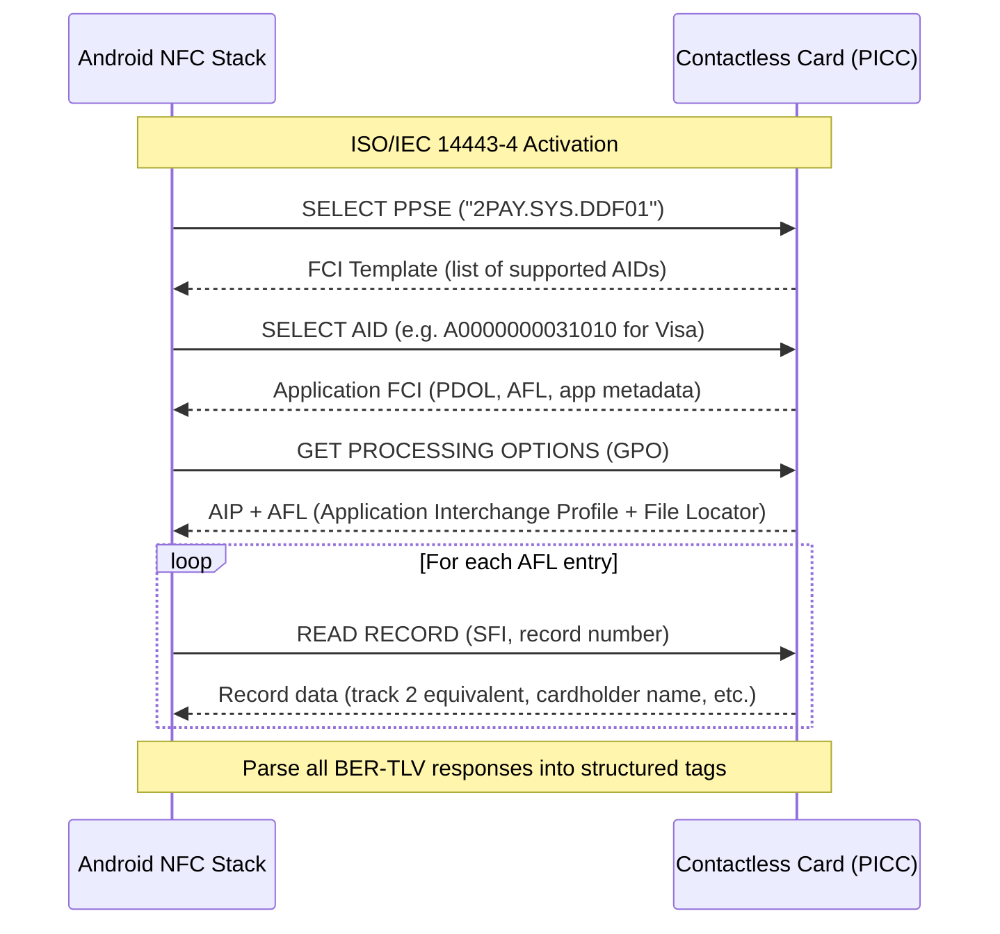

<p align="center">
  
</p>

<h1 align="center">NFC Probe</h1>

<p align="center">
  <strong>Android EMV Contactless Inspector</strong><br>
  APDU-level protocol analysis toolkit for contactless payment cards.
</p>

<p align="center">
  <a href="#"></a>
  <a href="#"></a>
  <a href="#"></a>
  <a href="#"></a>
  <a href="../../actions"></a>
  <a href="LICENSE"></a>
</p>

---

## What is this?

**NFC Probe** is a low-level Android toolkit for inspecting contactless EMV payment cards at the APDU layer. It speaks ISO/IEC 7816-4 to the card's payment application, walks the EMV transaction flow (PPSE → Application Selection → GPO → READ RECORD), parses the raw BER-TLV response into structured data, and presents the result in an organized, human-readable form.

It is *not* a consumer wallet, a payment app, or an NFC tag writer. It is an engineering instrument — useful for:

- Understanding what your contactless card actually transmits
- Debugging payment terminal integration
- Teaching EMV protocol internals
- Reverse-engineering proprietary card profiles
- Validating card personalization data
- Researching Android NFC stack behavior across OEMs

> **No network access. No telemetry. Card data stays on-device.**

---

## EMV Transaction Flow



NFC Probe performs exactly this flow. Every APDU is constructed and transmitted programmatically. The raw response bytes are parsed recursively using a BER-TLV decoder that handles:

- Single-byte and multi-byte tags (ISO/IEC 8825-1)
- Short-form and long-form length encoding
- Constructed (template) TLV recursion
- Inter-TLV `0x00` padding per EMV Book 3 §4.2
- `GET RESPONSE` chaining for `0x61xx` status words
- `Wrong Le` retry for `0x6Cxx` status words

---

## Supported Card Schemes

| Scheme | AID (hex) | PPSE | Fallback |
|--------|-----------|------|----------|
| Visa | `A0000000031010` | ✓ | ✓ |
| Mastercard | `A0000000041010` | ✓ | ✓ |
| American Express | `A0000000250101` | — | ✓ |
| JCB | `A0000000651010` | — | ✓ |
| UnionPay | `A0000003241001` | — | ✓ |
| Discover/Diners | `A0000001523010` | — | ✓ |
| Mir | `A000000677` | — | ✓ |
| Interac | *(by AID substring)* | — | ✓ |

If PPSE returns a usable AID, NFC Probe selects it directly. Otherwise, it tries each fallback AID until the card accepts one. Any ISO/IEC 14443-4 Type A/B card that speaks `IsoDep` is reachable — even non-payment cards expose their ATR and historical bytes for analysis.

---

## Decoded EMV Tags

NFC Probe extracts and decodes **30+ EMV tags** across five categories:

**Identity & card metadata** — Cardholder Name (5F20), Application Label (50), Application Preferred Name (9F12), Issuer URL (5F50), Issuer Country Code (5F28), Form Factor Indicator (9F6E)

**Payment data** — Application PAN (5A, masked to last 4 digits), Track 2 Equivalent Data (57, masked), Expiration Date (5F24), Service Code (5F30), Application Identifier / AID (4F, 9F06), Payment Account Reference (9F24)

**Transaction data** — Transaction Amount (9F02), Currency Code (5F2A), Transaction Date (9A), Transaction Type (9C), Terminal Country Code (9F1A), Transaction Currency Exponent (5F36), Transaction Category Code (9F53)

**Security & cryptography** — Application Cryptogram (9F26), Application Transaction Counter (9F36), Application Interchange Profile (82), Terminal Verification Results (95), CVM Results (9F34), Unpredictable Number (9F37), Issuer Application Data (9F10), Issuer Script Results (9F5B)

**Protocol internals** — Application File Locator (94), PDOL (9F38), FCI Template (6F), FCI Proprietary Template (A5), Response Message Templates (77, 80)

All values are decoded from their EMV wire-format encoding: BCD dates, ISO 4217 currency codes, ISO 3166-1 country codes, and AID-to-scheme mapping.

---

## Architecture

```
app/src/main/java/io/github/romantsisyk/nfccardreader/
│
├── app/
│   ├── NFCReaderApplication.kt    # Hilt entry point
│   └── MainActivity.kt            # Foreground dispatch + NFC intent routing
│
├── domain/
│   ├── EmvTag.kt                  # 44-entry EMV tag enum with hex-to-name mapping
│   ├── model/
│   │   ├── NFCData.kt             # Parsed card data DTO (30+ fields)
│   │   └── NfcResult.kt           # Typed result wrapper (Success / Error)
│   └── usecase/
│       ├── ProcessNfcIntentUseCase.kt   # Orchestrator: PPSE → SELECT → GPO → READ RECORD
│       ├── ParseTLVUseCase.kt           # Recursive BER-TLV decoder
│       └── InterpretNfcDataUseCase.kt   # Tag-to-field mapper + type decoder
│
├── data/
│   ├── repository/NfcRepositoryImpl.kt  # Room persistence + NFC orchestration
│   └── local/
│       ├── NfcDatabase.kt         # Room DB (v2, sensitive-tag filtering)
│       ├── dao/ScanDao.kt         # CRUD for scan history
│       └── entity/ScanEntity.kt   # Persisted scan record (masked fields only)
│
├── di/NfcModule.kt                # Hilt module: DB, DAO, repository binding
├── presentation/
│   ├── viewmodel/NFCReaderViewModel.kt  # StateFlow-backed UI state
│   ├── ui/NFCReaderScreen.kt      # Compose: collapsible card + TLV viewer
│   ├── ui/HistoryScreen.kt        # Compose: scan history list
│   └── navigation/NavGraph.kt     # Two-destination nav (reader / history)
│
└── utils/
    ├── NfcDataDecoder.kt          # EMV field decoders (BCD, ISO 4217, ISO 3166, SW)
    ├── NfcDataMasker.kt           # PAN / Track 2 masker (PCI-DSS aware)
    └── Extensions.kt              # String.orNA() utility
```

The domain layer has no Android imports. The data layer handles Room + `Intent` parsing. The presentation layer is pure Compose + ViewModel. Dependency injection wires the graph at compile time via Hilt + KSP.

---

## Security & Privacy

- **PAN masking** — Primary Account Number is reduced to `XXXXXXXXXXXX` + last 4 digits before display or persistence. Amex 15-digit BCD encoding (with trailing `F` nibble pad) is handled.
- **Track 2 masking** — Full discretionary data is stripped; only the masked PAN segment survives.
- **Sensitive tag filtering** — Cardholder name, expiration date, track data, PAN sequence number, CVM results, and issuer discretionary data are excluded from the Room persistence layer via an explicit denylist.
- **No network permission** — The manifest declares zero networking permissions. No data leaves the device.
- **Backup disabled** — `allowBackup="false"` + full data exclusion rules for both Android 6–11 backup and Android 12+ device-to-device transfer.
- **FLAG_SECURE** — Window flag prevents screenshots and screen recording of card data surfaces.
- **ProGuard obfuscation** — Aggressive repackaging (`-repackageclasses`), log stripping (`assumenosideeffects` on `Log.*` and `Throwable.printStackTrace`), and renaming in release builds.
- **Network security config** — System CA trust anchors only; user-installed CAs are excluded even in debug builds. Cleartext traffic is blocked.

### Known limitations

- Room database is not yet encrypted at rest (SQLCipher migration planned).
- No root/jailbreak detection (relies on Play Integrity for production deployment).
- `FLAG_SECURE` blocks accessibility services — disable in settings if screen-reader support is needed.

---

## Build & Run

**Requirements**
- Android Studio Hedgehog or later
- JDK 17
- Android SDK 35
- Gradle 8.7+ (wrapper included)

```bash
git clone https://github.com/romantsisyk/nfc-cardreader.git
cd nfc-cardreader
./gradlew assembleDebug          # build the debug APK
./gradlew testDebugUnitTest       # run unit tests
./gradlew lint                    # run static analysis
```

**IDE setup**
1. Open the project root in Android Studio.
2. Sync Gradle (the wrapper downloads everything).
3. Select `app` configuration → deploy to device.

**Release signing** (CI only):
```bash
export KEYSTORE_FILE=/path/to/keystore.jks
export KEYSTORE_PASSWORD=...
export KEY_ALIAS=...
export KEY_PASSWORD=...
./gradlew assembleRelease
```

---

## Testing

| Layer | Framework | Scope |
|-------|-----------|-------|
| EMV tag enum | JUnit 4 | Tag value uniqueness, description coverage, regex validation |
| TLV parser | JUnit 4 | PAN masking, multi-tag, truncated data, long-form length, PPSE FCI recursion |
| Data decoder | JUnit 4 | BCD dates, ISO 4217 currency, ISO 3166 country, SW decoding, edge cases |
| Data masker | JUnit 4 | 16-digit PAN, Amex 15-digit BCD, track 2 with separators |
| Repository | JUnit 4 + Robolectric | Sensitive tag filtering (reflection on private `serializeTlvMap`) |
| ViewModel | JUnit 4 + `StandardTestDispatcher` | State transitions, error propagation, save/clear flow |
| NfcResult | JUnit 4 | Success/Error/Loading state correctness |
| CI | GitHub Actions | `lint` → `testDebugUnitTest` → `assembleDebug` → `assembleRelease` (signed) |

Tests run in CI on every push and PR to `master`/`main`/`develop`.

---

## Roadmap

- [ ] SQLCipher encryption for Room database (Android Keystore-backed key)
- [ ] `enableReaderMode()` migration (Android 15+ NFC stack)
- [ ] ATR / historical bytes display for non-EMV cards
- [ ] APDU trace export (`.cap` / JSON)
- [ ] Custom APDU send/receive terminal
- [ ] MIFARE Classic / Ultralight sector dump
- [ ] NDEF message inspector
- [ ] FeliCa (Japan) system code probing
- [ ] Play Integrity attestation
- [ ] Crash reporting (Firebase Crashlytics)
- [ ] Accessibility mode toggle (disable `FLAG_SECURE`)
- [ ] Privacy policy + Data Safety section for Google Play

---

## Contributing

Bug reports and pull requests are welcome. Before submitting a PR:

1. Run `./gradlew lint testDebugUnitTest` and ensure zero failures.
2. If adding a new EMV tag, add it to `EmvTag`, `ParseTLVUseCase` (masking rules), `InterpretNfcDataUseCase` (decoding), and `NfcRepositoryImpl.SENSITIVE_TAGS` (persistence filter).
3. Keep domain-layer classes free of Android imports.
4. Follow the existing test patterns (JUnit 4, given/when/then comments).

For major changes, open an issue first to discuss the approach.

---

## License

MIT © [Roman Tsisyk](https://github.com/romantsisyk)

---

<p align="center">
  <sub>Built with Kotlin, Jetpack Compose, and the EMV Book 3 specification open on a second monitor.</sub>
</p>
